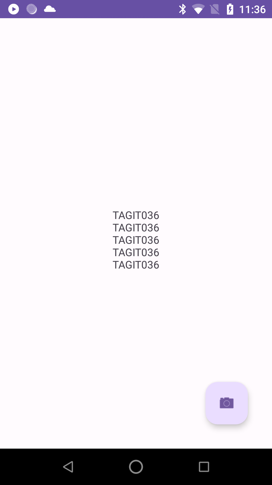
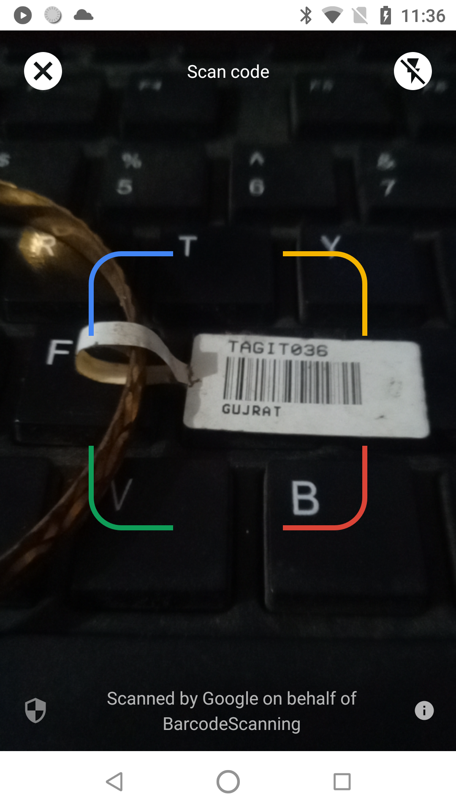

# Barcode Scanning Application

Welcome to the Barcode Scanning Application! This Android app leverages Google MLKit to provide seamless barcode scanning capabilities. It's designed to be an easy-to-implement solution for integrating barcode scanning into your Android projects.

## Features

- 📷 Scan barcodes of various formats.
- 🔍 Auto-zoom functionality for better barcode detection.
- 📊 Display scanned barcode results in real-time.

## Screenshots

| Home Screen                               | Scanning Barcode                           |
| ----------------------------------------- | ------------------------------------------ |
|  |  |
| Home screen of the application.           | Scanning a barcode using Google MLKit.    |


## Getting Started

### Prerequisites

- Android Studio 4.0 or higher
- Gradle 4.0 or higher
- Android SDK 21 or higher

### Installation

1. Clone the repository:
    ```sh
    git clone https://github.com/ifahimkhan/barcode-scanning-app.git
    ```
2. Open the project in Android Studio.
3. Sync the project with Gradle files.

### Usage

1. Build and run the app on your Android device or emulator.
2. Click the "Start Scanning" button to initiate the barcode scanner.
3. Point your camera at a barcode to scan it. The results will be displayed on the screen.

## Code Overview

### Main Components

- **MainActivity**: The main activity that handles the UI interactions and initializes the barcode scanner.
- **MainViewModel**: The ViewModel that separates the business logic from the UI, handling the barcode scanning process and managing the scan results using LiveData.

### Libraries Used

- [Google MLKit](https://developers.google.com/ml-kit/vision/barcode-scanning): For barcode scanning capabilities.
- [AndroidX](https://developer.android.com/jetpack/androidx): For modern Android components and architecture.

### Key Files

- `MainActivity.kt`: Contains the UI logic and binds the ViewModel to the activity.
- `MainViewModel.kt`: Handles the barcode scanning business logic.
- `activity_main.xml`: The main layout file containing the UI components.

## Contributing

Contributions are welcome! Please fork the repository and submit pull requests for any improvements or bug fixes.

## License

This project is licensed under the MIT License - see the [LICENSE](LICENSE) file for details.

## Contact

For any questions or feedback, please reach out via [LinkedIn](https://www.linkedin.com/in/ifahimkhan) or open an issue on GitHub.

---

⭐ If you find this project useful, please give it a star on GitHub!

